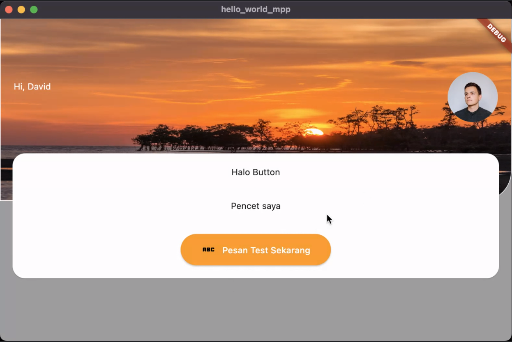
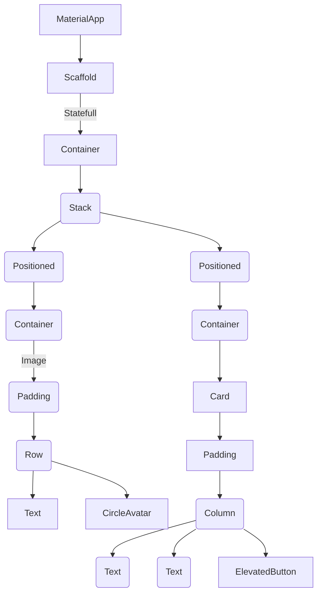
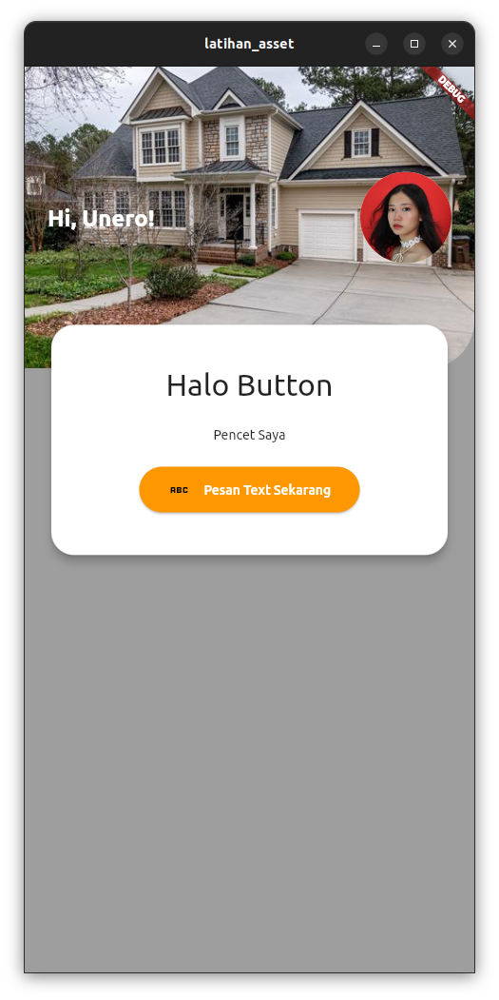
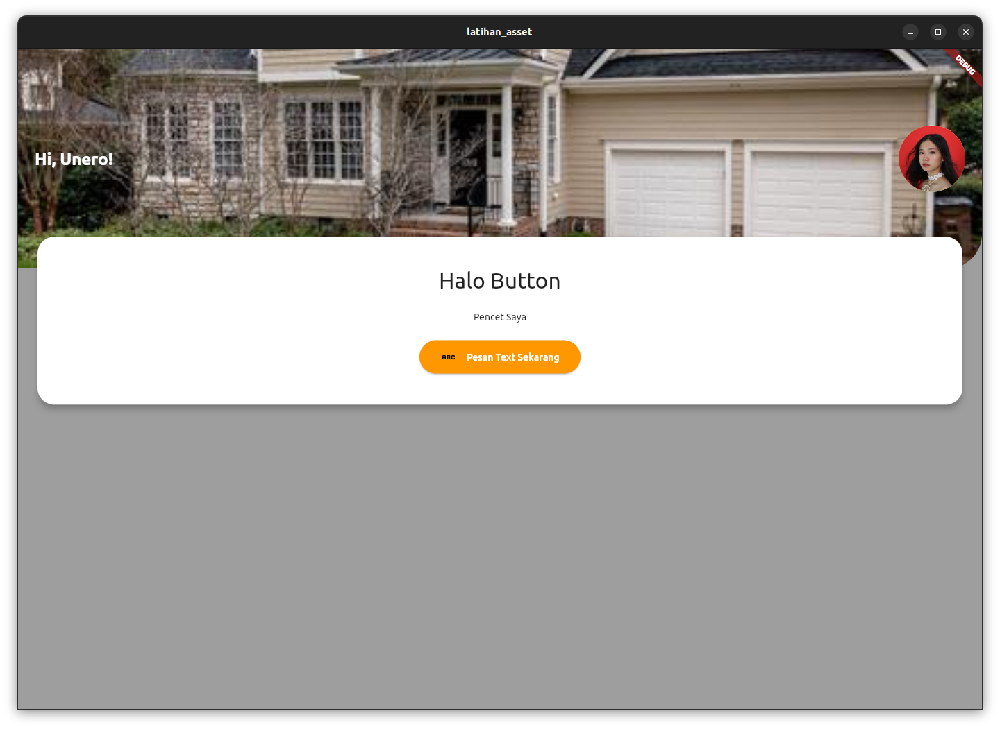

# Week 2

## 190922

## 210922

### Expected

## UI Tree

To Produce the UI above, I do the following steps:

```mermaid
flowchart TD
MaterialApp --> Scaffold
-- Statefull --> Container --> S(Stack)

S --> Pos1(Positioned) --> C1(Container) -- Image --> P1(Padding) --> R(Row) 
R --> Text
R --> CircleAvatar

S --> Pos2(Positioned) --> C2(Container) --> Card --> Padding --> C(Column)
C --> T1(Text)
C --> T2(Text)
C --> ElevatedButton
```

### Result (Responsive)

